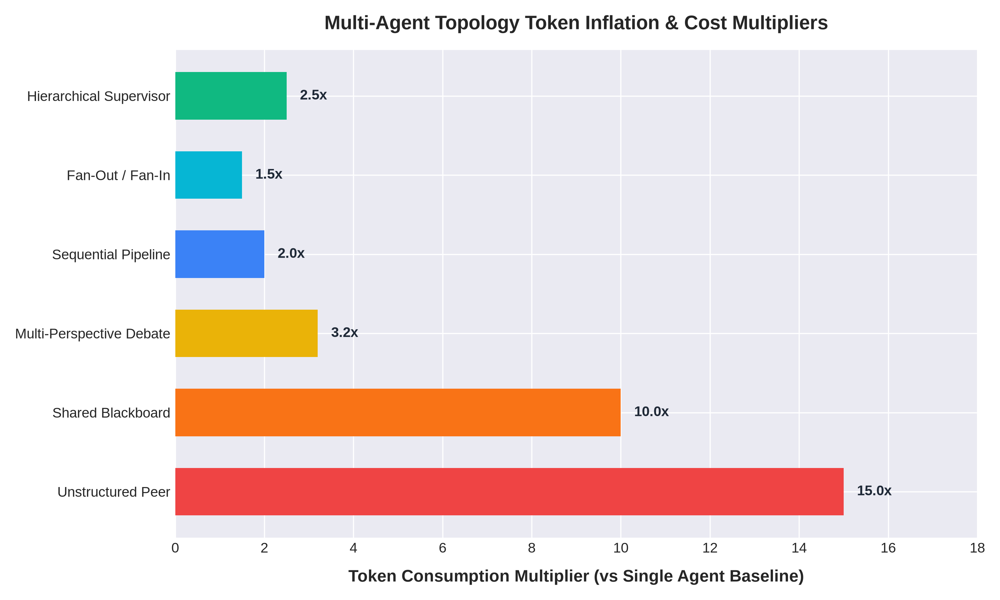
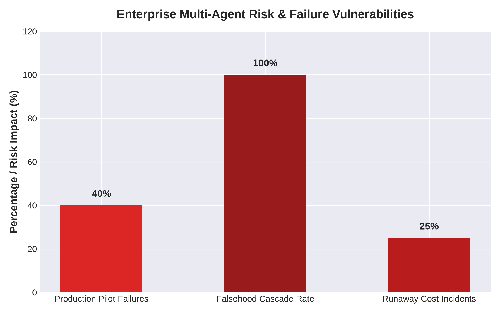

<div align="center">

# 🚀 Next-Generation Multi-Agent Orchestration
### *Architectures, Protocol Stacks, and Production Engineering Blueprint*

[](https://github.com/EdgeAgent/multi-agent-orchestration/stargazers)
[](https://opensource.org/licenses/MIT)
[]()

**Stop building chaotic chat rooms for your LLMs.** Discover how elite engineering teams build deterministic, fault-tolerant, and cost-controlled multi-agent systems.

</div>

---

## ⚡ The Multi-Agent Reality Check

Between early 2024 and mid-2025, enterprise inquiries regarding multi-agent architectures surged by **1,445%** [1]. While organizations maintain an average deployment of **12 distinct agents** across business units, empirical telemetry reveals a harsh production reality: **approximately 40% of multi-agent production pilots fail within six months of initial deployment [1].**

Unstructured peer topologies suffer from catastrophic token inflation, non-deterministic execution loops, and vulnerability to falsehood cascades. Multi-agent configurations consume up to **15 times more tokens** than single-agent chat baselines, with total token allocation accounting for nearly 80% of performance variance across multi-step execution graphs [1]. Furthermore, uncontrolled recursive loops have resulted in severe operational failures, generating resource costs exceeding **$75,000 per day** [1].

<div align="center">
  
  <p><em>Figure 1: Token consumption multipliers across multi-agent orchestration topologies.</em></p>
</div>

---

## 🏗️ Taxonomy of Multi-Agent Control Flow Patterns

Industrial orchestration relies on six primary operational topologies, differentiated by their control-flow state, communication boundaries, and execution models:

| Topology Pattern | Primary Control Mechanism | Optimal Operational Domain | Token Multiplier |
| :--- | :--- | :--- | :--- |
| **Fan-Out / Fan-In** | Scatter dispatcher → gather collector | Concurrent audits; parallel search | $1.2\times - 1.8\times$ [1] |
| **Sequential Pipeline** | Deterministic linear stage chain | Multi-step document ingestion | $1.5\times - 2.5\times$ [1] |
| **Multi-Perspective Debate** | Iterative adversarial critique | Strategic asset allocation; compliance | $2.5\times - 4.0\times$ [1] |
| **Hierarchical Supervisor** | Central coordinator delegates to subagents | Cross-functional planning & routing | $2.0\times - 3.0\times$ [1] |
| **Bounded Peer Mesh** | Shared workspace with phase gates | Incident response; exploratory search | $1.8\times - 3.0\times$ [1] |
| **Shared Blackboard (Hive)** | Asynchronous global state mutations | Complex, long-running quantitative tasks | $5.0\times - 15.0\times$ [1] |

---

## 🛡️ Enterprise Risk & Vulnerability Analysis

When building production multi-agent systems, engineering teams must guard against systemic failure modes. Specifically, the injection of an atomic falsehood into a centralized hub-and-spoke control node results in a **100% cascade failure rate** across connected subagent nodes [1].

<div align="center">
  
  <p><em>Figure 2: Key enterprise risk indicators and vulnerability metrics.</em></p>
</div>

---

## 🔌 Standardized Protocol Stack

To replace brittle, ad-hoc integration code, agent communications are organized into a standardized four-layer protocol stack:

1. **Model Context Protocol (MCP):** Developed by Anthropic and governed under the Linux Foundation's Agentic AI Foundation, MCP standardizes interactions between language models and external tools using JSON-RPC 2.0 over SSE or HTTP [1].
2. **Agent Communication Protocol (ACP):** Originated by IBM Research, ACP provides a REST-native messaging framework designed for internal agent-to-agent coordination over HTTP [1].
3. **Agent-to-Agent Protocol (A2A):** Spearheaded by Google Cloud alongside enterprise partners, A2A standardizes cross-organizational task delegation via Agent Cards hosted at RFC 8615 well-known endpoints (`/.well-known/agent.json`) [1].
4. **Agent Network Protocol (ANP):** ANP provides a decentralized discovery and execution layer using Decentralized Identifiers (DIDs) and JSON-LD knowledge graphs [1].

---

## 📂 Repository Structure

```text
multi-agent-orchestration/
├── README.md
├── docs/
│   ├── topologies.md
│   ├── protocols.md
│   ├── work-as-git.md
│   ├── token_inflation_chart.png
│   └── risk_metrics_chart.png
├── schemas/
│   ├── task_routing.json
│   └── subagent_contract.json
├── workflows/
│   └── hierarchical_supervisor.json
└── examples/
    └── cost_and_risk_model.py
```

---

## References

[1] Next-Generation Multi-Agent Orchestration: Architectures, Protocol Stacks, and OpenAlice Production Engineering. Architecture & Engineering Specification, 2026.
